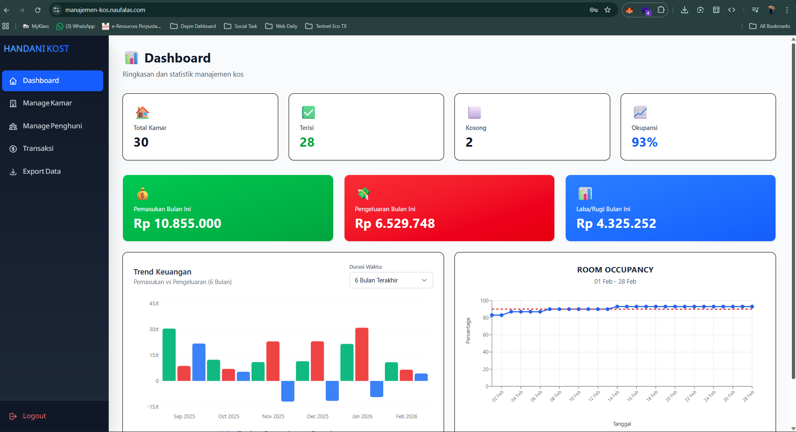
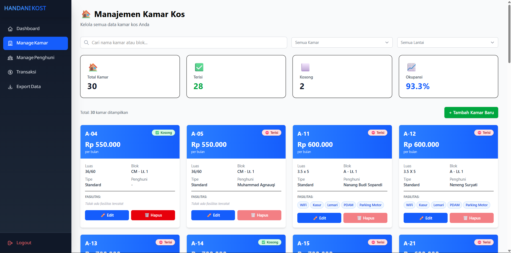
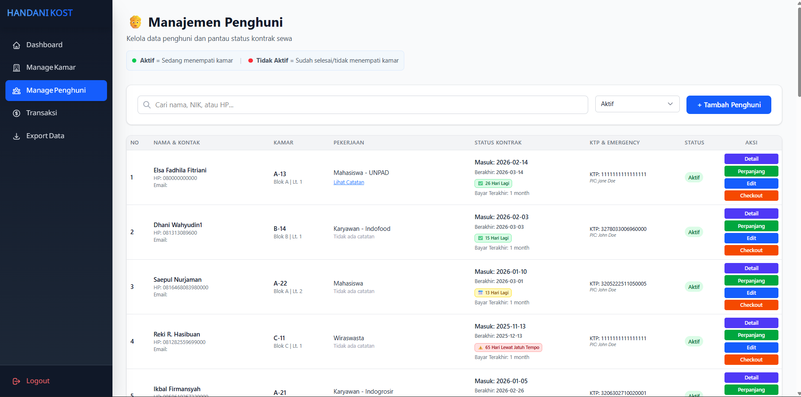
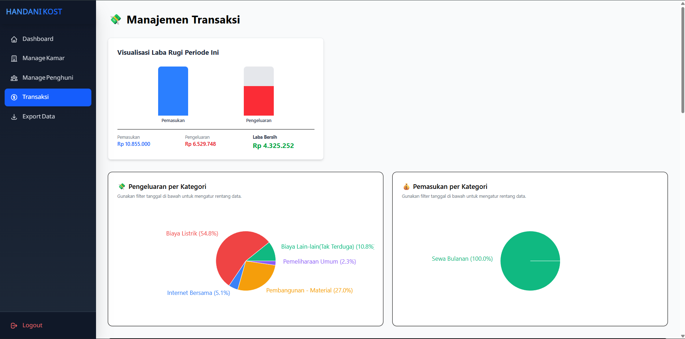
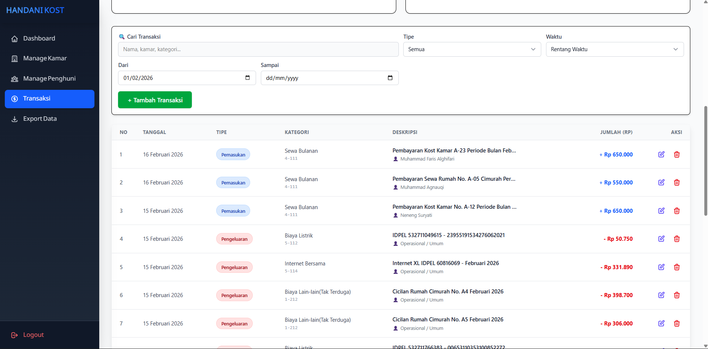
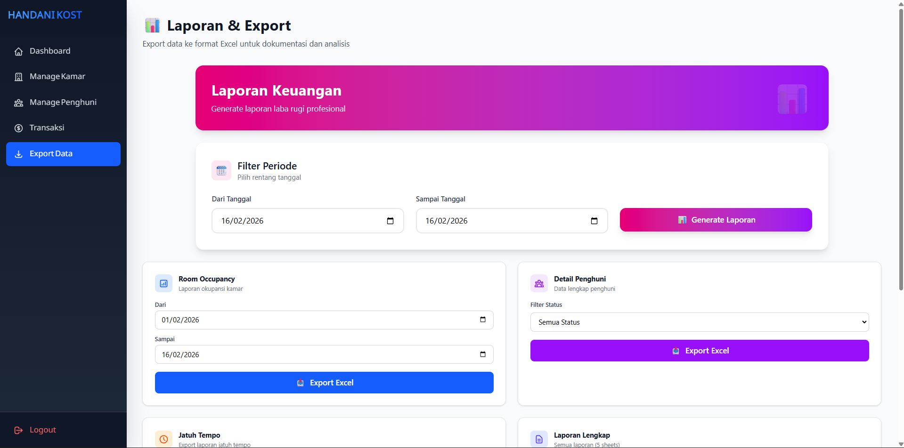
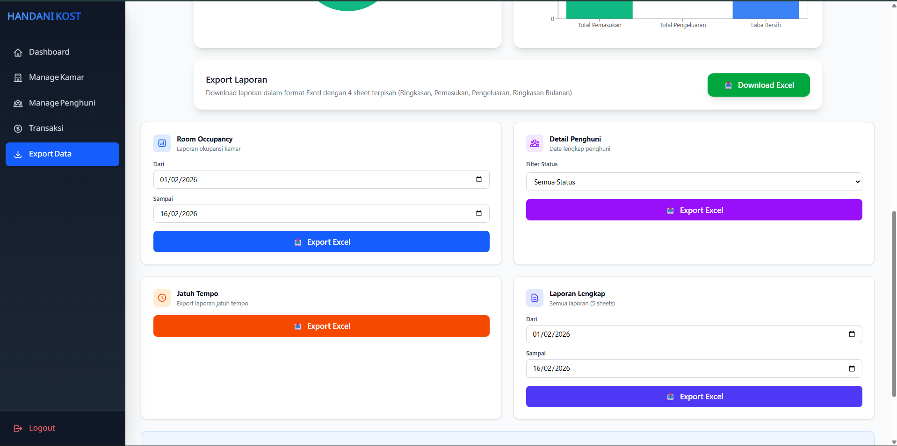

# Manajemen Kosan

Aplikasi manajemen kos-kosan berbasis web yang dibangun dengan **Laravel 10** (Backend) dan **React + Vite** (Frontend). Aplikasi ini dirancang untuk memudahkan pemilik kos dalam mengelola kamar, penghuni, dan transaksi keuangan.

## 🚀 Fitur Utama

- **Dashboard Interaktif**: Ringkasan statistik penghuni aktif, kamar tersedia, grafik trend keuangan, dan notifikasi jatuh tempo.
- **Manajemen Kamar**: CRUD data kamar, filter berdasarkan ketersediaan/lantai, dan status real-time.
- **Manajemen Penghuni**: Pencatatan data penghuni, check-in/check-out, perpanjangan sewa, dan riwayat sewa.
- **Transaksi Keuangan**: Pencatatan pemasukan (sewa) dan pengeluaran operasional dengan Chart of Accounts.
- **Laporan & Export**: Grafik laba rugi, laporan penghuni jatuh tempo, export Excel untuk berbagai data.

## 📸 Screenshots

| Dashboard Utama | Manajemen Kamar |
|:---:|:---:|
|  |  |

| Manajemen Penghuni | Analisa Keuangan |
|:---:|:---:|
|  |  |

| Riwayat Transaksi | Laporan & Export |
|:---:|:---:|
|  |  |

| Laporan Detail | |
|:---:|:---:|
|  | |


## 🛠️ Teknologi

- **Backend**: Laravel 10, MySQL
- **Frontend**: React 18, Tailwind CSS, Vite
- **State Management**: TanStack Query (React Query)
- **Komunikasi**: REST API (Axios)

## 📦 Instalasi & Setup

### Prasyarat

- PHP >= 8.1
- Composer
- Node.js & NPM
- MySQL

### 1. Backend Setup (Laravel)

```bash
cd manajemen-kos-api

# Install dependencies
composer install

# Setup Environment
cp .env.example .env
# Edit .env sesuaikan database credentials (DB_DATABASE, DB_USERNAME, dll)

# Generate Key
php artisan key:generate

# Run Migrations & Seeder
php artisan migrate --seed

# Run Server
php artisan serve
```

### 2. Frontend Setup (React)

```bash
cd manajemen-kos-frontend

# Install dependencies
npm install

# Setup Environment
cp .env.example .env
# Pastikan VITE_API_BASE_URL mengarah ke backend (default: http://127.0.0.1:8000/api)

# Run Development Server
npm run dev

# Build untuk Production
npm run build
```

## 📁 Struktur Frontend

```
src/
├── api/                    # API Client (Axios)
├── components/             # Reusable Components
│   ├── common/             # UI Components (Modal, Toast, etc)
│   ├── dashboard/          # Dashboard Widgets
│   ├── kamar/              # Kamar Components
│   ├── penghuni/           # Penghuni Components
│   └── transaksi/          # Transaksi Components
├── context/                # React Context (Toast)
├── hooks/                  # Custom Hooks (useMutations, usePenghunis, dll)
├── pages/                  # Page Components
├── routes/                 # Routing Configuration
└── utils/                  # Utility Functions
    └── validation/         # Modular Validation
        ├── common.js       # Validasi umum (NIK, HP, Email, dll)
        ├── penghuni.js     # Validasi form Penghuni
        ├── kamar.js        # Validasi form Kamar
        └── transaksi.js    # Validasi form Transaksi
```

## 📚 API Overview

| Method | Endpoint                         | Deskripsi                         |
| :----- | :------------------------------- | :-------------------------------- |
| `GET`  | `/api/kamars`                    | List semua kamar (support filter) |
| `GET`  | `/api/penghunis`                 | List semua penghuni               |
| `GET`  | `/api/transaksis`                | List transaksi keuangan           |
| `GET`  | `/api/reports/dashboard-stats`   | Statistik dashboard               |
| `GET`  | `/api/reports/financial-summary` | Ringkasan keuangan & trend        |

## 🔒 Security Features

- **Rate Limiting**: Mencegah brute force pada login dan spam request API.
- **Input Validation**: Validasi ketat di sisi server dan client dengan modular validation.
- **Sanctum Auth**: Token-based authentication untuk keamanan API.
- **Session Manager**: Auto logout saat token expired.

## 📝 Catatan Pengembang

- Logika validasi frontend dipecah ke folder `utils/validation/` untuk maintainability.
- Routing dikonfigurasi di `routes/AppRoutes.jsx` dengan lazy loading.
- Error boundary global di `GlobalErrorBoundary.jsx` untuk error handling.
- Backend menggunakan `Log::info` untuk mencatat aktivitas penting (Audit Trail).
